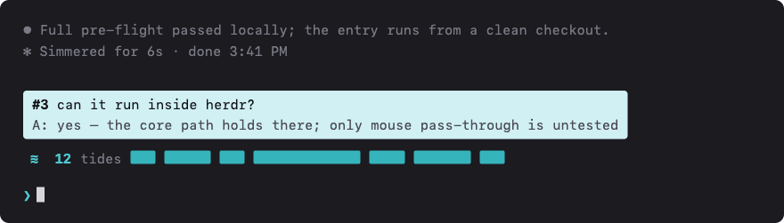

# Turn Tides

The tides of your conversation, drawn above the prompt — one bar per turn, hover for its summary, click to jump back to it.

A [Claude Code](https://code.claude.com) mod (function-hooks plugin) in the visual language of the official `token-weather`: where that one forecasts the context window, this one charts the session's turns.



## Install

In a Claude Code terminal session:

```
/plugin install turn-tides --marketplace pengkangzhen/turn-tides
```

Answer `y` to add the marketplace, pick the **user** scope, done — the strip is standing from the session's first prompt on, in every session.

## What it does

- **A bar per turn** — the session's questions in one strip above the prompt. A bar's width reads the length of its answer: the history at a glance, token-weather's chart turned horizontal.
- **Hover** a bar — the turn's question and an answer summary unfold above the strip.
- **Click** a bar — the transcript scrolls to that turn's question.
- `≋ 12 tides` — the count, styled like a weather forecast's headline.
- Seeded from the transcript on load (with a tail fallback for sessions past the read cap); live updates as turns complete.
- Collapsible with `[-]` or `ctrl+x ctrl+a`; composes with other band mods (e.g. `token-weather`) instead of claiming the band.

## Compatibility

- Fullscreen and main-screen layouts alike: no dock thresholds, works under tmux.
- Hover needs a terminal that reports mouse movement (Ghostty, iTerm2, kitty, WezTerm do); clicking and keyboard navigation work everywhere.

## Development

```
claude plugin validate .
claude plugin test .    # 3 engine-level tests
```

The hooks module is `hooks/register.tsx`; the state contract lives in `types/index.d.ts`.

## License

MIT
